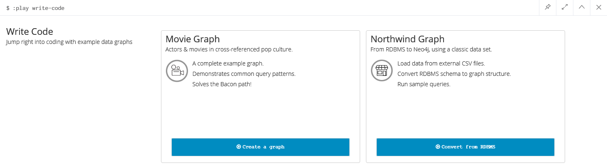
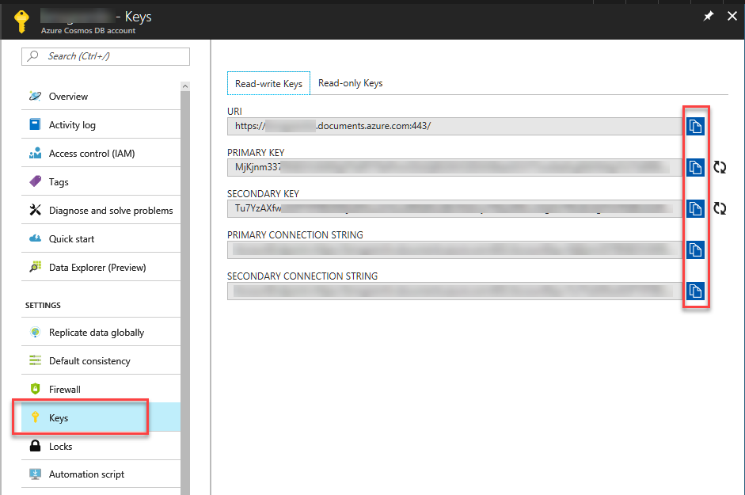

# neo4j to Cosmos DB

I have recently been enamored with the both the simplicity and complexity of Graph databases.

In May, at Build, Microsoft announced Cosmos DB with as the first "globally-distributed, multi-model database service." Upon exploring what that really meant, I found that one of the models they chose to natively support was Gremlin (graph) API. This was cool and got me really excited.

One of the best ways I have learned to understand a new technology is to take what I already know and try to apply it to the new shiny thing. This meant taking what I knew of neo4j and applying it to the Cosmos DB. The only thing stopping me was I needed data.

The genesis of this project was to solve my problem and copy all of the data from my neo4j to Cosmos DB with the least amount of work possible...and also give me a way to do an "Apples to Apples" comparison.

## So where to get started

If you want to get started with this project, the first thing you will need is a neo4j database. One quick way to get a hold of one is to use the developer's best friend...Docker!

Assuming you are on Windows, make sure you have Hyper-V configured, and install [Docker for Windows](https://docs.docker.com/docker-for-windows/)

Once you have that running (ready for linux containers I might add), spin up a copy of neo4j:

```
docker run --publish=7474:7474 --publish=7687:7687 --volume=$HOME/neo4j/data:/data neo4j
```

If you don't already have the neo4j image loaded, it will automatically download to your computer. Then, Docker will start up the image and set up both the neo4j bolt on port 7687 and the neo4j browser on port 7474. Finally, it will store all of the data in your user home directory under neo4j/data. This way, your data will survive container reboots.

Next, point your browser over to http://localhost:7474 to spin up the data browser for neo4j. The initial login/password will be "neo4j/neo4j" and you will have to change the password. Remember this password, you will need it again in a little bit. You could spend some time learning about Graph databases, but we want data...so fire up the code. Start one of the code walkthroughs to load up some data.

```
:play write-code
```



```
:play movie-graph
```
or
```
:play northwind-graph
```
Walkthrough enough to completely load the data. Be careful...the last step of the movie-graph will have you deleting all your new data.

Either way...you are now ready to load up your Cosmos DB with some good Graph data.

## Get Your Cosmos DB ready

Don't want to rewrite the internet here, so head on over to the Azure Cosmos DB documentation and follow the directions to "Create a Database Account".

https://docs.microsoft.com/en-us/azure/cosmos-db/create-graph-dotnet

You won't need to create a graph, because the code will do that for you.

## Final steps

Finally, clone this repository. Before you run the code, you will need to create an `app.config` file with the settings to your neo4j database as well as your Azure database. It should look like this:

```
<?xml version="1.0" encoding="utf-8"?>
<configuration>
  <startup> 
      <supportedRuntime version="v4.0" sku=".NETFramework,Version=v4.5.2" />
  </startup>
  <appSettings>
    <add key="CosmosEndpoint" value="Step1 Below" />
    <add key="CosmosAuthKey" value="Step2 Below" />
    <add key="NeoBolt" value="bolt://localhost:7687" />
    <add key="NeoUser" value="neo4j" />
    <add key="NeoPass" value= "new password" />
  </appSettings>
  <runtime>
    <assemblyBinding xmlns="urn:schemas-microsoft-com:asm.v1">
      <dependentAssembly>
        <assemblyIdentity name="Newtonsoft.Json" publicKeyToken="30ad4fe6b2a6aeed" culture="neutral" />
        <bindingRedirect oldVersion="0.0.0.0-9.0.0.0" newVersion="9.0.0.0" />
      </dependentAssembly>
    </assemblyBinding>
  </runtime>
</configuration>
```

### Step 1: Get Your Cosmos DB Endpoint.


Select the Keys tab of your Azure Cosmos DB account you will see the "URI"...copy that value to the `CosmosEndpoint`.

```
<add key="CosmosEndpoint" value="https://mycosmosdb.documents.azure.com:443/" />
```

### Step 2: Get Your Cosmos DB AuthKey.
The primary or secondary key can be used as the `CosmosAuthKey`
```
<add key="CosmosAuthKey" value="MjKjnm3378NB2VUMIKfg5TtdRT70ePhmODzDjBSZ4VOZEXt56kaUlCH77srsAkeErg9dHMdg7LCTs69l9Lqesw==" />
```
> Hint: Use the copy button...it way easier than trying to select it with a mouse.

### Step 3: neo4j config
If you used the defaults, you should only need to set the NeoPass to whatever you changed it to when you first logged in.

### Step 4: Watch your data copy
You should now be able to run the app and see your data appear in your Cosmos DB.

> Note: This project is not supported by Microsoft in any way and may become non-functional at any time. This is an independent project and I would love for you to submit pull requests for anything you think could be better. This will not work with the Cosmos DB emulator as this interfaces with the Graph (gremlin) API and this is not currently supported in the emulator at this time.